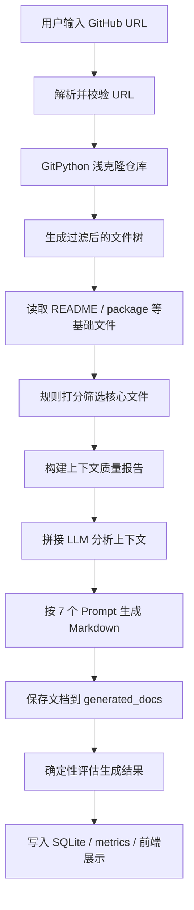

# CodebaseCoach

CodebaseCoach 是一个面向前端开发者和 AI 应用开发实习求职者的 GitHub 仓库分析工具。用户输入公开 GitHub 仓库地址后，系统会克隆仓库、扫描目录、筛选核心文件、构建 LLM 上下文，并生成面向项目学习、面试准备和简历表达的 Markdown 文档。

这个项目不是聊天机器人，也不是在线 IDE。它的重点是把“让 AI 帮我理解一个开源项目”产品化为一条可解释、可追踪、可复盘的工作流。

## 项目背景

准备实习面试时，很多候选人会遇到两个问题：

- 看开源项目时不知道先读哪些文件。
- 直接问 ChatGPT 时，模型容易脱离真实仓库上下文，回答难以复盘，也难以转化成简历和面试材料。

CodebaseCoach 的思路是先用确定性工程流程控制输入：只解析公开 GitHub 仓库，只读取有限数量的基础文件和核心文件，再把这些上下文交给 LLM 生成结构化文档。前端展示文件树、核心文件、Agent 步骤、工具调用日志和 Markdown 结果，让用户知道系统读了什么、做了什么、输出依据是什么。

## 核心功能

- GitHub URL 解析：支持 `https://github.com/owner/repo` 和 `https://github.com/owner/repo.git`。
- 仓库读取：使用 GitPython 将公开仓库浅克隆到 `temp_repos/`。
- 文件树生成：过滤 `.git`、`node_modules`、`dist`、`build`、`.venv`、`__pycache__` 等目录。
- 基础文件读取：读取 `README.md`、`package.json`、`requirements.txt`、`pyproject.toml` 等摘要。
- 核心文件筛选：基于文件名、入口文件、核心目录和源码类型打分，默认最多选 12 个文件。
- LLM 文档生成：通过 OpenAI 兼容接口生成 7 份 Markdown 文档。
- Agent 过程展示：返回 `AgentStep` 和 `ToolCallLog`，记录阶段状态、工具输入输出、耗时和失败原因。
- 异步任务与 SSE：支持创建后台分析任务、通过 SSE 接收阶段事件、逐篇文档生成事件和 metrics 更新。
- 持久化：SQLite 保存分析任务、事件、产物索引、步骤、工具调用和 LLM 调用；Markdown 正文保存在 `generated_docs/`。
- 质量评估：对生成文档做确定性检查，输出引用准确率、覆盖率、幻觉风险和可用性分。
- 前端页面：包含首页、分析工作台、文档页、历史记录页和设置页。

## 当前能力边界

- 当前主分析接口需要配置真实 `LLM_API_KEY` 或兼容供应商 Key；当前代码没有暴露 `/api/agent/analyze/mock`。
- 响应中保留 `mock_mode` 字段，用于区分历史阶段或兼容数据来源；当前主流程返回 `mock_mode=false`。
- 只支持公开 GitHub 仓库，不支持私有仓库授权、指定分支、上传 zip 或多用户登录。
- 当前没有接入 LangChain、LangGraph、MCP、RAG 或向量数据库。
- 当前不会自动提交 PR，也不会修改目标仓库代码。
- 生成结果评估是确定性检查，不是 LLM-as-judge。

## 技术栈

| 层 | 技术 |
| --- | --- |
| 前端 | Vue 3、TypeScript、Vite、Naive UI、Pinia、Vue Router、markdown-it、highlight.js |
| 后端 | Python、FastAPI、Pydantic、Uvicorn、GitPython、OpenAI Python SDK |
| 存储 | SQLite、SQLAlchemy、Alembic、Markdown 文件 |
| 通信 | HTTP、SSE |
| 测试 | Python unittest、前端 TypeScript 构建检查 |

## 架构设计

```text
Browser
  |
  | HTTP / SSE
  v
Vue 3 Web App
  - HomePage
  - WorkspacePage
  - DocsPage
  - HistoryPage
  - SettingsPage
  |
  v
FastAPI Server
  - api/       请求入口
  - schemas/   Pydantic 请求和响应模型
  - services/  仓库读取、文件筛选、LLM、历史、指标、评估
  - agent/     工作流编排、Prompt、ToolRegistry
  - db/        SQLAlchemy 模型和 Repository
  |
  +--> temp_repos/       临时克隆仓库
  +--> generated_docs/   Markdown 文档正文
  +--> data/             SQLite 数据库
  +--> OpenAI-compatible LLM API
```

后端采用分层结构：

- API 层只负责接收请求、调用服务、返回响应。
- Service 层承载仓库读取、文件树、文件筛选、文档存储、指标、评估等业务逻辑。
- Agent 层负责编排分析流程、Prompt 和工具注册。
- Repository 层隔离 SQLite 持久化，避免 API 和 workflow 直接依赖 SQLAlchemy 表结构。

## Agent 工作流

同步分析和异步 job 分析都围绕同一条可控工作流展开：

```text
1. 校验 LLM 配置
2. 解析 GitHub URL
3. 克隆公开仓库
4. 构建过滤后的文件树
5. 读取基础文件摘要
6. 筛选核心文件并读取有限内容
7. 生成上下文质量报告
8. 构建 LLM 分析上下文
9. 调用 LLM 生成 7 份 Markdown 文档
10. 保存 Markdown 到 generated_docs/
11. 对生成结果做确定性评估
12. 汇总 metrics、保存历史和运行明细
```

每个阶段通过 `AgentStep` 记录状态和耗时，通过 `ToolCallLog` 记录工具名称、权限、输入摘要、输出摘要、相关文件、耗时和错误。失败时，后端会把已执行步骤和工具日志放入结构化错误响应，前端可以展示失败发生在哪一步。

## 核心流程图



## 生成文档

一次成功分析会生成 7 份 Markdown：

```text
01-项目概览.md
02-技术栈分析.md
03-核心模块解析.md
04-核心流程说明.md
05-面试问题与回答.md
06-简历描述.md
07-可贡献PR方向.md
```

生成结果会保存在：

```text
generated_docs/{owner}_{repo}_{timestamp}/
```

数据库只保存文档索引、路径和统计信息，不把 Markdown 正文全部塞进数据库。

## API 文档

### 健康检查

```text
GET /health
```

返回服务状态、服务名和版本。

### 仓库解析

```text
POST /api/repo/parse
```

请求：

```json
{
  "repo_url": "https://github.com/owner/repo"
}
```

返回 `owner`、`repo` 和规范化后的 `repo_url`。无效 URL 返回 `INVALID_GITHUB_URL`。

### 仓库预扫描

```text
POST /api/repo/scan
```

会解析 URL、克隆仓库、生成文件树并读取基础文件摘要。返回：

- `file_tree`
- `basic_files`
- 仓库基本信息

### 同步分析

```text
POST /api/agent/analyze
```

会执行完整分析流程。当前代码会先校验 LLM 配置，没有 Key 时返回 `LLM_API_KEY_MISSING`。

核心响应字段：

- `file_tree`
- `basic_files`
- `core_files`
- `context_quality_report`
- `agent_steps`
- `tool_logs`
- `documents`
- `result_evaluation`
- `metrics`
- `docs_dir`
- `mock_mode`

### 异步分析任务

```text
POST /api/agent/analyze/jobs
GET  /api/agent/analyze/jobs/{job_id}
GET  /api/agent/analyze/jobs/{job_id}/events
POST /api/agent/analyze/jobs/{job_id}/cancel
```

异步任务使用后台线程执行分析。`/events` 是 SSE 接口，会推送：

- `job_started`
- `stage_started`
- `stage_completed`
- `stage_failed`
- `metrics_updated`
- `document_generated`
- `job_completed`
- `job_failed`
- `job_cancelled`

### 历史记录

```text
GET    /api/history
DELETE /api/history/{record_id}
```

历史记录来自 SQLite 中的 `analysis_jobs`，返回仓库、状态、文档目录、核心文件数量、错误信息等。

### 文档读取

```text
GET /api/docs/{history_id}
```

根据历史记录读取对应 `generated_docs/` 下的 Markdown 文档。

## Prompt 设计说明

Prompt 统一维护在 `apps/server/app/agent/prompts.py`，由两层组成：

- `SYSTEM_PROMPT`：定义全局约束，例如只能基于提供的仓库上下文回答、引用具体文件路径、信息不足时说明不确定、区分事实/推测/建议、输出 Markdown。
- `REAL_DOCUMENT_PROMPTS`：定义 7 类文档各自的标题、文件名和生成指令。

LLM 输入上下文由三部分拼接：

- 仓库信息：`owner`、`repo`、`repo_url`。
- 基础文件摘要：README、package manifest、requirements 等。
- 核心文件摘要：规则筛选后的源码和配置文件内容预览。

为了控制 token 和减少幻觉，项目没有把整个仓库直接发给模型，而是先做文件过滤、文件数量限制、单文件字节限制和上下文质量报告，再把有限上下文传给模型。

## 本地运行方式

### 1. 安装前端依赖

在仓库根目录执行：

```powershell
corepack enable
pnpm install
```

### 2. 配置后端环境

```powershell
cd apps/server
python -m venv .venv
.\.venv\Scripts\Activate.ps1
pip install -r requirements.txt
Copy-Item .env.example .env
```

编辑 `apps/server/.env`，至少配置：

```env
LLM_PROVIDER=deepseek
LLM_API_KEY=your_deepseek_api_key
LLM_MODEL=deepseek-v4-flash
LLM_BASE_URL=https://api.deepseek.com
```

兼容字段 `OPENAI_API_KEY` 和 `OPENAI_MODEL` 仍保留，但当前配置读取优先使用 `LLM_*`。

### 3. 启动后端

```powershell
cd apps/server
.\.venv\Scripts\Activate.ps1
uvicorn app.main:app --reload --port 8000
```

验证：

```powershell
Invoke-RestMethod http://localhost:8000/health
```

### 4. 启动前端

```powershell
cd apps/web
pnpm dev
```

前端默认访问：

```text
http://localhost:5173
```

后端默认访问：

```text
http://localhost:8000
```

## 部署和启动方式

当前项目以本地开发和演示为主，推荐部署方式是前后端分开启动：

- 后端：使用 Uvicorn 运行 FastAPI，默认端口 `8000`。
- 前端：开发环境使用 Vite dev server，默认端口 `5173`。
- 数据库：默认使用本地 SQLite 文件 `data/codebasecoach.db`，首次使用时后端会通过 SQLAlchemy 初始化表结构；也可以使用 Alembic migration 管理 schema。
- 文档输出：生成的 Markdown 正文保存在 `generated_docs/`，部署时需要保证后端进程对该目录有写权限。
- 临时仓库：clone 的公开仓库存放在 `temp_repos/`，部署时需要定期清理或限制磁盘空间。

生产化部署还需要额外补充进程守护、反向代理、日志采集、密钥管理、磁盘清理和访问控制。当前仓库尚未提供 Dockerfile、云部署脚本或多用户生产配置。

## 环境变量说明

| 变量 | 默认值 | 说明 |
| --- | --- | --- |
| `LLM_PROVIDER` | `deepseek` | LLM 提供商标识，用于记录 metrics |
| `LLM_API_KEY` | 空 | OpenAI 兼容接口 Key，当前主分析流程需要配置 |
| `LLM_MODEL` | `deepseek-v4-flash` | 模型名称 |
| `LLM_BASE_URL` | `https://api.deepseek.com` | OpenAI 兼容接口 base URL |
| `OPENAI_API_KEY` | 空 | 兼容旧配置，优先级低于 `LLM_API_KEY` |
| `OPENAI_MODEL` | `deepseek-v4-flash` | 兼容旧配置 |
| `TEMP_REPO_DIR` | `../../temp_repos` | 临时 clone 仓库目录 |
| `GENERATED_DOCS_DIR` | `../../generated_docs` | Markdown 文档输出目录 |
| `DATABASE_URL` | `sqlite:///../../data/codebasecoach.db` | SQLite 数据库地址 |
| `BACKEND_CORS_ORIGINS` | `http://localhost:5173` | 允许访问后端的前端地址 |
| `MAX_BASIC_FILE_BYTES` | `20000` | 单个基础文件读取上限 |
| `MAX_CORE_FILES` | `12` | 核心文件数量上限 |
| `MAX_CORE_FILE_BYTES` | `12000` | 单个核心文件读取上限 |
| `MAX_FILE_TREE_DEPTH` | `4` | 文件树最大深度 |
| `MAX_FILE_TREE_ENTRIES` | `1000` | 文件树最大节点数 |

## 运行截图占位

当前仓库还没有提交正式运行截图。建议后续补充以下图片：

```text
docs/assets/screenshots/home.png
docs/assets/screenshots/workspace-streaming.png
docs/assets/screenshots/generated-docs.png
docs/assets/screenshots/history.png
docs/assets/screenshots/settings.png
```

截图建议覆盖：

- 首页仓库输入。
- 工作台中的文件树、核心文件、Agent 步骤、工具日志和文档预览。
- SSE 分析过程中的文档逐篇生成状态。
- 历史记录打开旧文档。
- 设置页后端健康检查。

## 项目亮点

- 可解释的 AI 工作流：不是直接把问题丢给模型，而是把仓库解析、文件筛选、上下文构建、LLM 生成和质量评估拆成可追踪阶段。
- 上下文控制：通过规则筛选、字节限制、候选统计和上下文质量报告控制 token 成本。
- 工具调用审计：通过 ToolRegistry 声明工具来源、权限、输入输出 schema 和脱敏规则，未注册工具会被拒绝执行。
- 生成结果评估：通过确定性检查识别无效文件引用、占位词、面试题数量不足和潜在夸大表达。
- 工程闭环完整：Vue 工作台、FastAPI 服务、SQLite 持久化、SSE 事件流、Markdown 落盘和测试覆盖形成完整可运行链路。

## 面试材料

面试复习材料整理在：

```text
docs/interview/
```

包含：

- `项目介绍.md`
- `技术选型说明.md`
- `开发困难复盘.md`
- `技术对比与取舍.md`
- `高频面试问答.md`

这些材料来自 `docs/stage-notes/` 的阶段复盘和当前代码实现，区分了历史 mock 阶段、当前真实 LLM 主流程和后续规划。

## 后续规划

- 恢复或重新设计显式 mock 分析入口，让无 Key 演示路径和真实 AI 路径都清晰可用。
- 在前端展示上下文质量报告和生成结果评估详情。
- 支持更多 OpenAI 兼容模型供应商的配置说明。
- 支持指定分支、本地 zip 上传或更细粒度的仓库读取策略。
- 增加更多 golden eval 样例，用于 Prompt 和上下文策略回归。
- 在真实需求明确后扩展 MCP 工具接入和 RAG 代码问答。
- 增加部署文档和生产环境配置建议。
